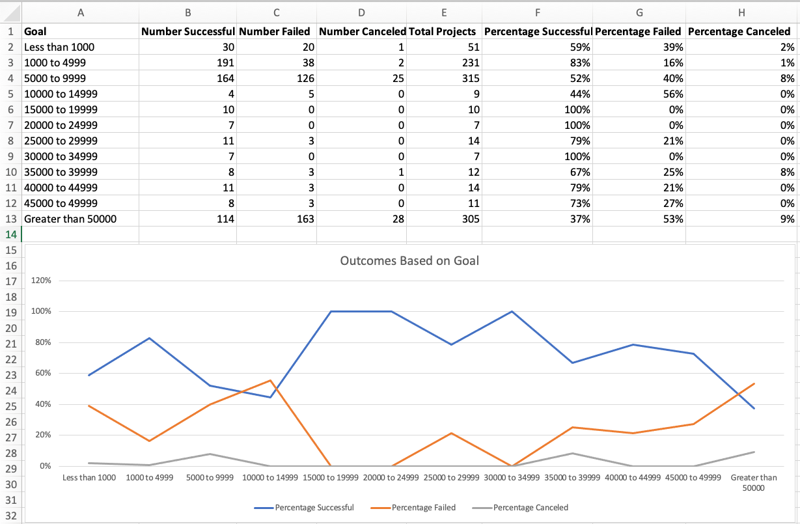
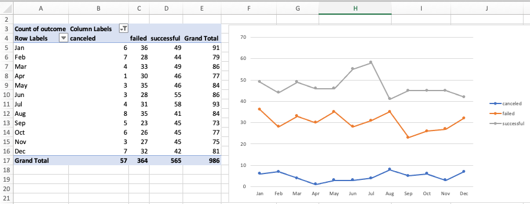
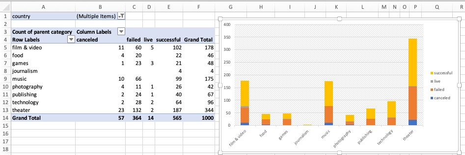

# Excel Challenge (Crowdfunding) 

## Background

Crowdfunding platforms like Kickstarter and Indiegogo have been growing in success and popularity since the late 2000s. From independent content creators to famous celebrities, more and more people are using crowdfunding to launch new products and generate buzz, but not every project has found success.

To receive funding, the project must meet or exceed an initial goal, so many organizations dedicate considerable resources looking through old projects in an attempt to discover “the trick” to finding success. For this week's Challenge, you will organize and analyze a database of 1,000 sample projects to uncover any hidden trends.

## Report

### Conclusion 

* Given the provided data, what are three conclusions that we can draw about crowdfunding campaigns?

  1. Given the data provided, it is possible to see that campaigns with a goal set between $1,000 and $4,999 are more likely to be successful than failed if compared to campaigns with a goal greater than $50,000.

  2. Looking into the pivot table and pivot chart below filtered by month, it does not help us to deeply understand the failed and successful campaigns' context. The numbers are too similar. 

  3. When we look into this data by categories, we can see that category Theater has almost 2x more campaigns in this sample than the second biggest category Film & Video. So, people really are into Theater, or this sample is too small to give us a real idea about the reality (I stand with the latter . In addition, we can see that for the category Film & Video the number of successful projects is 2x the number of failed. However, the successful and failed outcomes for the category Theater are very close.

* What are some limitations of this dataset?

  * As of 2021, there were 1,478 crowdfunding organizations in the United States, and there were 6,455,080 worldwide crowdfunding campaigns[^1]. Therefore, if we want to draw more significant results we need a sample larger than 1000 campaigns. 

  * This dataset does not include all categories and subcategories. Kickstarter, for example, categorizes their projects into one of 13 categories and 36 subcategories[^2], and in this sample is showing us only 9 categories and 24 subcategories.

* What are some other possible tables and/or graphs that we could create, and what additional value would they provide?

  * We could compare the number of backers by month to see what is the most successful month. Therefore, we could try to understand if people are more susceptible to donate in specific months. 

### Statistical Analysis

* Use your data to determine whether the mean or the median better summarizes the data.

  * For this data I would prefer to use the median because we have values in the sample that are from too small  to too large. Also, the number of outliers for successful campaigns are 7% of the total number of them.

* Use your data to determine if there is more variability with successful or unsuccessful campaigns. Does this make sense? Why or why not?
  * Based in my data Successful campaigns show more variability. We can see this looking into the variance of the number of backers. Also, the standard deviation for the number of backers for the Successful campaigns are higher than unsuccessful ones.

## References:

[^1]: https://www.fundera.com/resources/crowdfunding-statistics - Crowdfunding Statistics (2021): Market Size and Growth

[^2]: https://en.wikipedia.org/wiki/Kickstarter - Kickstarter

